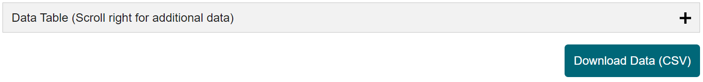

# CDC Community Level
## Background
On February 25, 2022 the CDC announced new guidelines for Covid-19 prevention (more information [here](https://www.cdc.gov/coronavirus/2019-ncov/downloads/science/Scientific-Rationale-summary-COVID-19-Community-Levels.pdf)). This project aims to retrieve the most recent CDC data programatically and present it clearly in plain text.
## Technical Considerations
By examining the CDC Covid-19 Community Levels website ([link](https://www.cdc.gov/coronavirus/2019-ncov/science/community-levels.html)), it's clear that there is dynamic content which drives how the tables with the data are shown. Also, the Download button is dynamic.
To scrape the data it would be possible to either click on the plus (+) sign to expand the table, or to click the Download button. To ensure data integrity I chose the latter as this method returns a CSV file which is easier to wrangler in Python. Other options were considered (`requests` and `BeautifulSoup`) but these had the downside of not finding the dynamic content.
Ultimately this project uses `Selenium` to allow for the dynamic content to generate and to click the Download Data button to retrieve the CSV file.

## How is the Data Used
The data in the CSV is used to generate maps, and show any county specific results to end users. Esentially if we have access to this file then it will be possible to replicate any visuals and extract any data available to the public. The advantage is that we can take this data and analyze it in different ways.

## Applications
At this moment this project is very much localized to the county I live in, but in the future there could more dynamic content or aggregate data results to present a better picture.
These are some of the the ideas I had in mind:
* Find top 10 counties by state for number of cases and hospitalizations.
* Show CDC guidelines given the Covid-19 Community Level.
* National/state maps.